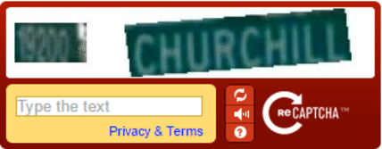

## Tecnologias web para construção de cadastros de área em pesquisas agropecuárias { .clear .boldtlt .off}


<p class="black">
**André Leite** (leite@castlab.org)
<br>
**Cristiano Ferraz** (cferraz@castlab.org)
<br>
**Raydonal Ospina** (raydonal@castlab.org)
</p>


##  
<h2 class="shout">Outline</h2>
<p>Test</p>

## Topics

<div style='float:left;width:48%;' class='centered'>

- Area frames
- Crowdsourcing
- `R`
- `Shiny`
- Infraestrutura
- Master Sampling Project

</div>
<div style='float:right;width:48%;margin-top:-100px;'>
```{r echo=FALSE, message=FALSE, out.height='420px', out.width='470px'}
library(tidyverse)
library(leaflet)
library(rgdal)
library(rgeos)
library(tibble)
library(leaflet)
library(htmltools)

tractsGoiana <- read_rds("data/tractsGoiana.rds")
segmentsGoiana <- read_rds("data/segmentsGoiana.rds")
goiana_points <- read_rds("data/goiana_points.rds")

points779 <- goiana_points %>% select(Segment, latitude, longitude, Reference, imageLatitude, imageLongitude) %>%  filter(Segment == 779)

 tractsGoiana@data  <- tractsGoiana@data %>%
   mutate(Label = paste("ID",ID, "Area: ", round(Area,1), "hec"))

leaflet() %>% addTiles() %>%
  addProviderTiles("Esri.WorldImagery", group = "WorldImagery") %>%
  addPolygons(data = tractsGoiana[tractsGoiana$Segment == "779",],
              color = "#444444", weight = 1, smoothFactor = 0.5,
              opacity = 1.0, fillOpacity = 0.5,
              fillColor = ~colorQuantile("YlOrRd", as.integer(Tract))(as.integer(Tract)),
              highlightOptions = highlightOptions(color = "white", weight = 2,
                                                  bringToFront = FALSE),
              label = ~Label,
               labelOptions = labelOptions(noHide = FALSE, opacity = .75, direction = "auto", offset = c(90, 0))) %>%
  addPolygons(data = segmentsGoiana["779",], popup = "Goiana Segment 779",
              fill = FALSE, weight = 4, smoothFactor = 0.5,
              opacity = 1.0, fillOpacity = 1, color = "white", options = popupOptions(minWidth = 20, closeOnClick = FALSE, closeButton = FALSE)) %>%
  addCircles(data = points779, lng = ~longitude, lat = ~latitude, popup =~Reference, radius = 15, opacity =  1, color = "white") %>%
  addMarkers(data = points779, lng = ~as.numeric(imageLongitude), lat = ~as.numeric(imageLatitude), popup =~Reference)

```
</div>


##  
<h2 class="shout">Area Frames</h2>
<p>Test</p>


## Area Frames {.small-list}

<div style='float:left;width:65%;' class='centered'>

> 1. Sampling units can assume a variety of forms
> 2. Built upon GPS/GIS/Remote sensing type of data
> 3. <strong style="color:ForestGreen">Furnishes complete population coverage </strong>
> 4. <strong style="color:ForestGreen">Keeps updated over time </strong>
> 5. Provides indirect access to reporting units
> 6. <strong style="color:DeepSkyBlue ">Needs maintenance for stratification purposes  </strong>
> 7. <strong style="color:OrangeRed">High costs to build an area frame  </strong>
> 8. <strong style="color:OrangeRed">Finding reporting units can require high efforts </strong>

<blockquote>
  <p>Ferraz & Mecatti</p>
</blockquote>

</div>
<div style='float:right;width:35%;margin-top:0px;'>
```{r echo=FALSE, message=FALSE, out.height='300px', out.width='350px'}
goiana_grid <- read_rds("data/goiana_grid.rds")
goiana <- read_rds("data/goiana.rds")
goiana_grid %>% leaflet() %>%
  addTiles() %>%
  addPolygons(color = "#FF4500", weight = 1, fillOpacity = .1,
              highlightOptions = highlightOptions(color = "white", weight = 2,
                                                  bringToFront = FALSE),
              label = ~as.character(ID),
               labelOptions = labelOptions(noHide = FALSE, opacity = .75, direction = "auto", offset = c(180, 60))) %>%
  addPolygons(data = goiana, weight = 2, fill = FALSE, opacity = 1)

```
</div>

##  
<h2 class="shout">Crowdsourcing</h2>
<p>Test</p>

## Crowdsourcing

<p class="note">Definition</p>
<figure>
    <blockquote>
        <p>the practice of obtaining information or input into a task or project by enlisting the services of a large number of people, either paid or unpaid, typically via the Internet.</p>
    </blockquote>
    <figcaption>Oxford Dictionary (lexico.com)</figcaption>
</figure>

## Crowdsourcing (Examples 1/4) {.visited .active}

<div style="float:left;width:45%;margin-top:100px" class='centered'>

</div>
<div style="float:right;width:45%;margin-top:100px">

</div>

## Crowdsourcing (Examples 2/4) {.visited .active}

<div style='float:left;width:45%;' class='centered'>

</div>
<div style='float:right;width:45%;'>

</div>

## Crowdsourcing (Examples 3/4) {.visited .active .off}

<div style='float:left;width:48%;' class='centered'>

</div>
<div style='float:right;width:48%;'>

</div>

## Crowdsourcing (Examples 4/4) {.visited .active}

<center>

</center>

##  {.off}

<center>

</center>

##  {.off}

<center>

</center>


## {.off}

<center>

</center>

## Shout

<h2 class="shout">Infrastructure</h2>


## {.off}

<center>

</center>


## {.off}

<center>

</center>


## {.off}

<center>

</center>


## Grid { .grid }

## Note

<p>Text</p>
<p class="note">Note</p>
<figure>
    <blockquote>
        <p>Post-ironic fashion axe flexitarian</p>
    </blockquote>
    <figcaption>Yours Truly</figcaption>
</figure>

## Shout

<h2 class="shout">Shout</h2>


## Place


## R Markdown {.off}

This is an R Markdown presentation. Markdown is a simple formatting syntax
for authoring HTML, PDF, and MS Word documents. For more details on using R
Markdown see <http://rmarkdown.rstudio.com>.

When you click the **Knit** button a document will be generated that
includes both content as well as the output of any embedded R code chunks
within the document.

<footer class="footer">
<p>Cosby sweater Shoreditch.</p>
</footer>

## Shower

These slides use a template from the [shower](https://github.com/shower/shower)
presentation system. Notable features:

1. Works in all modern browsers
1. Presentation fully keyboard accessible
1. Multiple themes available
1. Printable to PDF

<p class="note"> Shower ['ʃəuə] noun. A person or thing that shows.</p>

## Slide with Plain Text

Let me see your identification. You don't need to see his
identification. We don't need to see his identification. These are not the
droids your looking for. These are not the droids we're looking for. He can
go about his business. You can go about your business.

Move along. Move along. Move along.

## Two column layout


<p class="double">
What is it? Your fathers lightsaber. This is the weapon of a Jedi
Knight. Not as clumsy or as random as a blaster. An elegant weapon for a
more civilized time. For over a thousand generations the Jedi Knights were
the guardians of peace and justice in the Old Republic. Before the dark
times, before the Empire. How did my father die? A young Jedi named Darth
Vader, who was a pupil of mine until he turned to evil, helped the Empire
hunt down and destroy the Jedi Knights.
</p>

## Two column layout, text and image

<p class="double">
How did I get into this mess? I really don't know how. We seem to be made
to suffer. It's our lot in life. I've got to rest before I fall apart. My
joints are almost frozen. What a desolate place this is. Where are you
going?

How did I get into this mess? I really don't know how. We seem to be made
to suffer. It's our lot in life. I've got to rest before I fall apart. My
joints are almost frozen. What a desolate place this is. Where are you
going?

</p>

## Two column layout, image and text

<p class="double">

How did I get into this mess? I really don't know how. We seem to be made
to suffer. It's our lot in life. I've got to rest before I fall apart. My
joints are almost frozen. What a desolate place this is. Where are you
going?
</p>

## Two column layout, independent columns

<div class="double">
<p class="double-flow">
How did I get into this mess? I really don't know how. We seem to be made
to suffer.
</p><p class="double-flow">
It's our lot in life. I've got to rest before I fall apart.
</p>
</div>


## Lists

1. Simple lists are marked with bullets
1. Ordered lists begin with a number
1. You can even nest lists one inside another
    * Or mix their types
    * But do not go too far
    * Otherwise audience will be bored
1. Look, seven rows exactly!

## Formulas

Formulas are rendered by KaTeX, https://github.com/Khan/KaTeX

It supports both inline: \(y = x / 2\) and displayed formulas:

\[ x_{1,2} = \frac{- b \pm \sqrt{b^2 - 4ac}}{2a} \]

## Slide with quote

> The bad news is that when ever you learn a new skill you're going to
> suck. It's going to be frustrating. The good news is that is typical and
> happens to everyone and it is only temporary. You can't go from knowing
> nothing to becoming an expert without going through a period of great
> frustration and great suckiness.

**Hadley Wickham **


## Slide with R Code and Output { .small-code }

```{r message=FALSE}
summary(cars)
```

## Tables


<div class = "tbls">

|                   |  mpg  |  cyl  |  disp  |  hp  |
|:-----------------:|:-----:|:-----:|:------:|:----:|
|     Mazda RX4     | 21    |   6   |  160   | 110  |
|   Mazda RX4 Wag   | 21    |   6   |  160   | 110  |
|    Datsun 710     | 22.8  |   4   |  108   |  93  |
|   Hornet 4 Drive  | 21.4  |   6   |  258   | 110  |
| Hornet Sportabout | 18.7  |   8   |  360.0 | 175  |
|       Valiant     | 18.1  |   6   |  225.0 | 105  |
|      Duster 360   | 14.3  |   8   |  360.0 | 245  |

</div>

## Pictures { .white }


<p class="white">
And text on top of them.
</p>


## Lists item by item

> 1. Lets you reveal list items one by one
> 2. To keep some key points
> 3. In secret from audience
> 4. But it will work only once
> 5. Nobody wants to see the same joke twice

## Slide with Plot

```{r, echo=FALSE, dev='svg'}
par(mar = c(5, 4, 1, 2) + 0.1)
pairs(iris[1:4], pch = 21,
      bg = c("red", "green3", "blue")[unclass(iris$Species)])
```

## Div Test

<style>
div.blue { background-color:#e6f0ff; border-radius: 5px; padding: 20px;}
</style>
<div class = "blue">
- This is my first conclusion
- This is my second conclusion
</div>

## Kable test { .small-code }

```{r tables-mtcars}
library(DT)
datatable(mtcars, rownames = FALSE,
          filter="top",
          options = list(pageLength = 5, scrollX=TRUE) )
```

# Full Page Plots

## { .fullpage }

<div class="fullpage width">
```{r, echo=FALSE, dev='svg'}
par(mar = c(5, 4, 1, 2) + 0.1)
pairs(iris[1:4], pch = 21,
      bg = c("red", "green3", "blue")[unclass(iris$Species)])
```
</div>

## More information

### About R markdown: http://rmarkdown.rstudio.com

### About shower: https://github.com/shower/shower

### Example shower presentation: http://shwr.me/