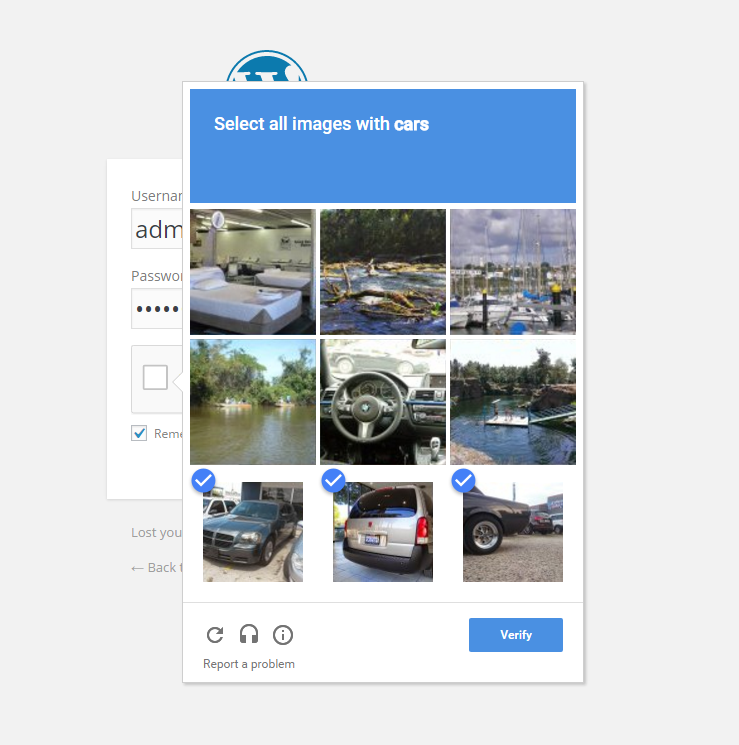
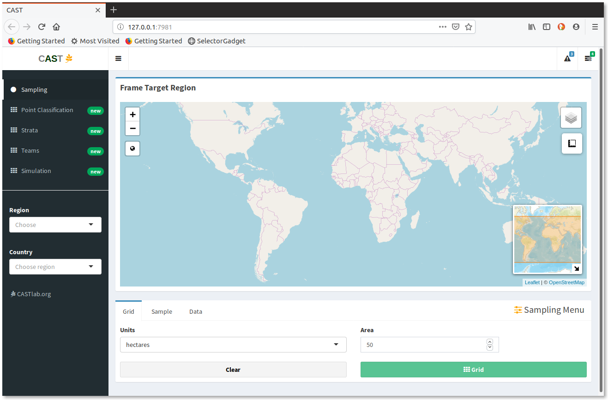
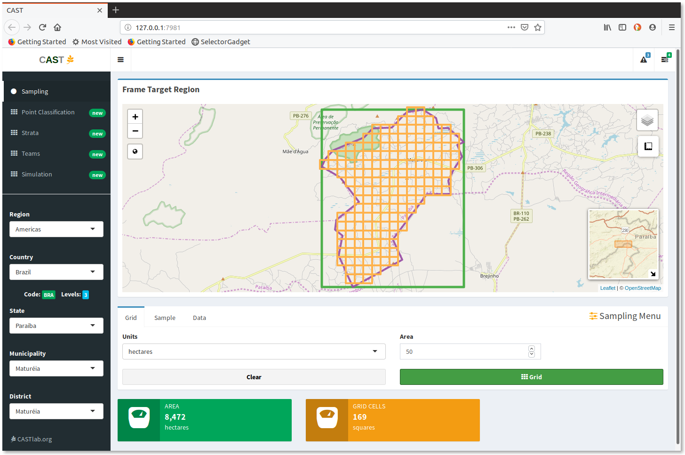
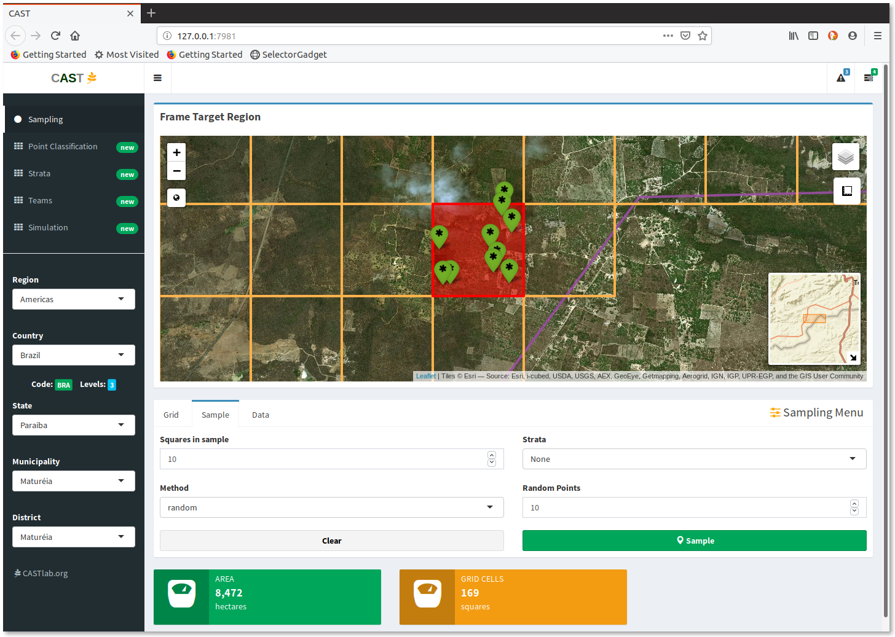
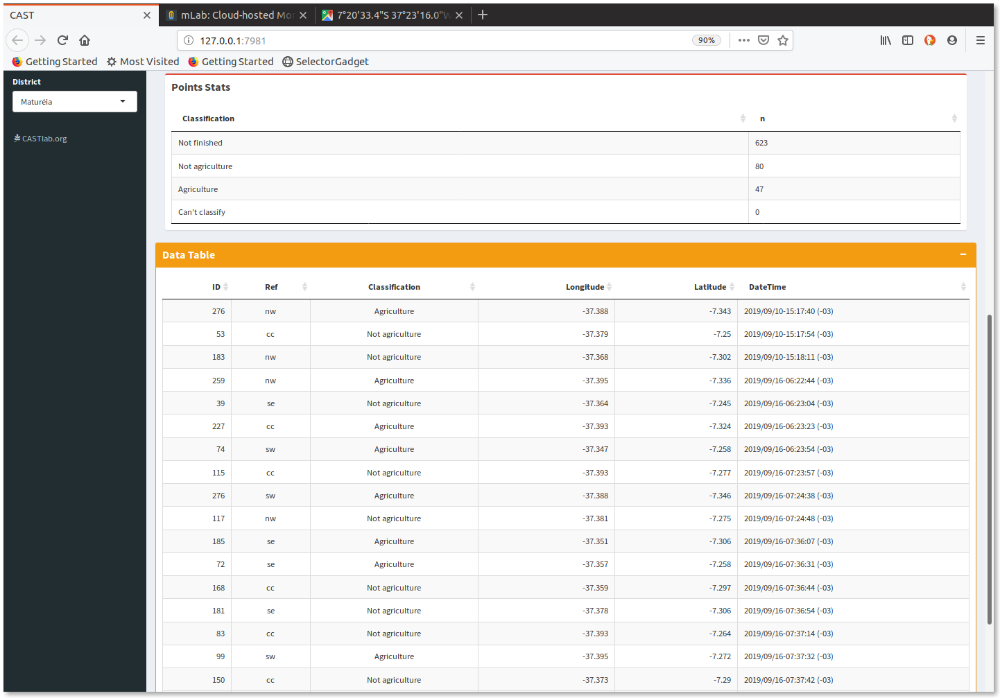
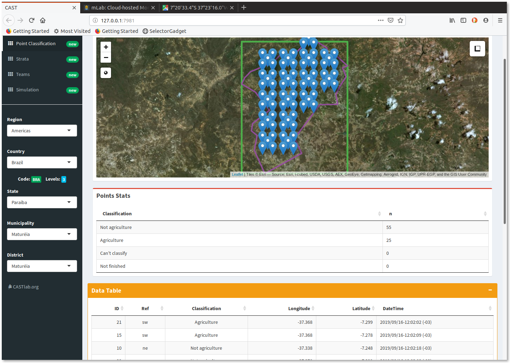
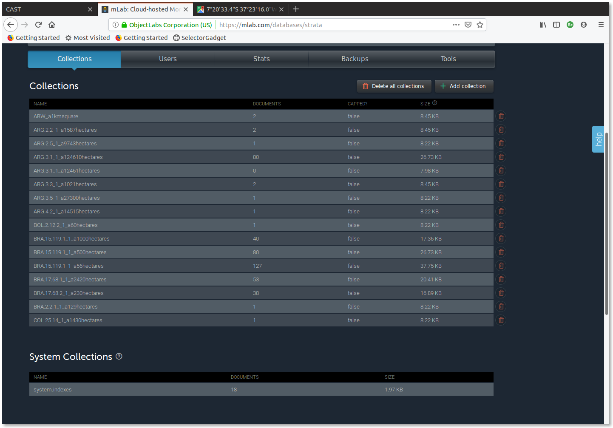

## {.off}

<div class = "place center">
<canvas id="canvas" width ="400px" height="400px">
</canvas>
</div>
<script>
var canvas = document.getElementById("canvas");
var ctx = canvas.getContext("2d");
var radius = canvas.height / 2;
ctx.translate(radius, radius);
radius = radius * 0.90
setInterval(drawClock, 1000);

function drawClock() {
  drawFace(ctx, radius);
  drawNumbers(ctx, radius);
  drawTime(ctx, radius);
  drawDot(ctx);
}

function drawFace(ctx, radius) {
  ctx.beginPath();
  ctx.arc(0, 0, radius, 0, 2*Math.PI);
  ctx.fillStyle = "rgba(255, 255, 255)"; 
  //'white';
  ctx.fill();
  ctx.strokeStyle = 'MediumSeaGreen';
  ctx.lineWidth = radius*0.1;
  ctx.stroke();
  ctx.beginPath();
  ctx.arc(0, 0, radius*0.1, 0, 2*Math.PI);
  ctx.fillStyle = 'green';
  ctx.fill();
}
function drawDot(ctx) {
  ctx.strokeStyle = 'black';
  ctx.lineWidth = radius*0.-5;
  ctx.stroke();
  ctx.beginPath();
  ctx.arc(0, 0, radius*0.05, 0, 2*Math.PI);
  ctx.fillStyle = 'black';
  ctx.fill();
}
function drawNumbers(ctx, radius) {
  var ang;
  var num;
  ctx.font = radius*0.12 + "px Roboto Mono";
  ctx.textBaseline="middle";
  ctx.textAlign="center";
  for(num = 1; num < 13; num++){
    ang = num * Math.PI / 6;
    ctx.rotate(ang);
    ctx.translate(0, -radius*0.85);
    ctx.rotate(-ang);
    ctx.fillText(num.toString(), 0, 0);
    ctx.rotate(ang);
    ctx.translate(0, radius*0.85);
    ctx.rotate(-ang);
  }
}

function drawTime(ctx, radius){
    var now = new Date();
    var hour = now.getHours();
    var minute = now.getMinutes();
    var second = now.getSeconds();
    //hour
    hour=hour%12;
    hour=(hour*Math.PI/6)+
    (minute*Math.PI/(6*60))+
    (second*Math.PI/(360*60));
    drawHand(ctx, hour, radius*0.5, radius*0.07, '#588c7e');
    //minute
    minute=(minute*Math.PI/30)+(second*Math.PI/(30*60));
    drawHand(ctx, minute, radius*0.8, radius*0.07,'#d96459');
    // second
    second=(second*Math.PI/30);
    drawHand(ctx, second, radius*0.9, radius*0.02, '#f2e394');
}

function drawHand(ctx, pos, length, width, color) {
    ctx.beginPath();
    ctx.lineWidth = width;
    ctx.lineCap = "round";
    ctx.moveTo(0,0);
    ctx.rotate(pos);
    ctx.lineTo(0, -length);
    ctx.strokeStyle = color;
    ctx.stroke();
    ctx.rotate(-pos);
}
</script>


## Tecnologias web para construção de cadastros de área em pesquisas agropecuárias { .clear .boldtlt .off}


<p class="black">
**André Leite** (leite@castlab.org)
<br>
**Cristiano Ferraz** (cferraz@castlab.org)
<br>
**Raydonal Ospina** (raydonal@castlab.org)
</p>

##  
<h2 class="shout">CASTLab</h2>
<p>Test</p>


## CASTLab.org {.off}
<div
 style="padding-bottom:56.25%; position:relative; display:block; width: 100%; height=300px">
 <iframe style="border: none;"
  width="100%" height="400px"
  src="https://castlab.org"
  frameborder="0" allowfullscreen=""
  style="position:absolute; top:0; left: 0"></iframe>
</div>

##  
<h2 class="shout">Outline</h2>
<p>Test</p>

## Topics

<div style='float:left;width:48%;' class='centered'>

- Area frames
- Crowdsourcing
- `R`
- `Shiny`
- Infrastructure
- Master Sampling Project

</div>
<div style='float:right;width:48%;margin-top:-100px;'>
```{r echo=FALSE, message=FALSE, out.height='420px', out.width='470px'}
library(magrittr)
library(tidyverse)
library(leaflet)
library(rgdal)
library(rgeos)
library(tibble)
library(leaflet)
library(htmltools)


tractsGoiana <- read_rds("data/tractsGoiana.rds")
segmentsGoiana <- read_rds("data/segmentsGoiana.rds")
goiana_points <- read_rds("data/goiana_points.rds")

points779 <- goiana_points %>% select(Segment, latitude, longitude, Reference, imageLatitude, imageLongitude) %>%  filter(Segment == 779)

 tractsGoiana@data  <- tractsGoiana@data %>%
   mutate(Label = paste("ID",ID, "Area: ", round(Area,1), "hec"))

leaflet() %>% addTiles() %>%
  addProviderTiles("Esri.WorldImagery", group = "WorldImagery") %>%
  addPolygons(data = tractsGoiana[tractsGoiana$Segment == "779",],
              color = "#444444", weight = 1, smoothFactor = 0.5,
              opacity = 1.0, fillOpacity = 0.5,
              fillColor = ~colorQuantile("YlOrRd", as.integer(Tract))(as.integer(Tract)),
              highlightOptions = highlightOptions(color = "white", weight = 2,
                                                  bringToFront = FALSE),
              label = ~Label,
               labelOptions = labelOptions(noHide = FALSE, opacity = .75, direction = "auto", offset = c(0, 0))) %>% # 90, 0
  addPolygons(data = segmentsGoiana["779",], popup = "Goiana Segment 779",
              fill = FALSE, weight = 4, smoothFactor = 0.5,
              opacity = 1.0, fillOpacity = 1, color = "white", options = popupOptions(minWidth = 20, closeOnClick = FALSE, closeButton = FALSE)) %>%
  addCircles(data = points779, lng = ~longitude, lat = ~latitude, popup =~Reference, radius = 15, opacity =  1, color = "white") %>%
  addMarkers(data = points779, lng = ~as.numeric(imageLongitude), lat = ~as.numeric(imageLatitude), popup =~Reference)

```
</div>


##  
<h2 class="shout">Area Frames</h2>
<p>Test</p>


## Area Frames {.small-list}

<div style='float:left;width:65%;' class='centered'>

> 1. Sampling units can assume a variety of forms
> 2. Built upon GPS/GIS/Remote sensing type of data
> 3. <strong style="color:ForestGreen">Furnishes complete population coverage </strong>
> 4. <strong style="color:ForestGreen">Keeps updated over time </strong>
> 5. Provides indirect access to reporting units
> 6. <strong style="color:DeepSkyBlue ">Needs maintenance for stratification purposes  </strong>
> 7. <strong style="color:OrangeRed">High costs to build an area frame  </strong>
> 8. <strong style="color:OrangeRed">Finding reporting units can require high efforts </strong>

<blockquote>
  <p>Ferraz & Mecatti</p>
</blockquote>

</div>
<div style='float:right;width:35%;margin-top:0px;'>
```{r echo=FALSE, message=FALSE, out.height='300px', out.width='350px'}
goiana_grid <- read_rds("data/goiana_grid.rds")
goiana <- read_rds("data/goiana.rds")
goiana_grid %>% leaflet() %>%
  addTiles() %>%
  addPolygons(color = "#FF4500", weight = 1, fillOpacity = .1,
              highlightOptions = highlightOptions(color = "white", weight = 2,
                                                  bringToFront = FALSE),
              label = ~as.character(ID),
               labelOptions = labelOptions(opacity = .75, offset = c(0, 0))) %>% # 180, 60
  addPolygons(data = goiana, weight = 2, fill = FALSE, opacity = 1)

```
</div>

##  
<h2 class="shout">Crowdsourcing</h2>
<p>Test</p>

## Crowdsourcing

<p class="note">Definition</p>
<figure>
    <blockquote>
        <p>the practice of obtaining information or input into a task or project by enlisting the services of a large number of people, either paid or unpaid, typically via the Internet.</p>
    </blockquote>
    <figcaption>Oxford Dictionary (lexico.com)</figcaption>
</figure>

## Crowdsourcing (Google $1/4$) {.visited .active}

<div style="float:left;width:45%;margin-top:100px" class='centered'>

</div>
<div style="float:right;width:45%;margin-top:100px">

</div>

## Crowdsourcing (Google $2/4$) {.visited .active}

<div style='float:left;width:45%;' class='centered'>

</div>
<div style='float:right;width:45%;'>

</div>

## Crowdsourcing (Google $3/4$) {.visited .active .off}

<div style='float:left;width:48%;' class='centered'>

</div>
<div style='float:right;width:48%;'>

</div>

## Crowdsourcing (Google $4/4$) {.visited .active}

<center>

</center>

##  {.off}

<center>

</center>

##  {.off}

<center>

</center>

<div id="#flex-container" width="100%">
<div style='float:left;width:33%;padding-left:50px;padding-top:25px;margin:0;' class='flex-item'>
> - `leaflet`
> - `tidyverse`
</div>
<div style='float:left;width:33%;padding-left:50px;padding-top:25px;margin:0' class='flex-item'>
> - `RColorBrewer`
> - `rmarkdown`
</div>
<div style='float:left;width:33%;padding-left:50px;padding-top:25px;margin:0' class='flex-item'>
> - `rgdal`
> - `rgeos`
> - `sp` vs. `sf`
</div>
</div>


## Toy model (Uruguay)

<div style="font-size:80%;" heigth='80%'>
```{r, tidy='styler', message=FALSE, fig.height=3}
set.seed(123)
library(rgdal)
library(raster)
library(rgeos)
library(tidyverse)
uruguay <- getData('GADM', country='URY', level=0)
uruguay_projected <- spTransform(uruguay, CRS("+init=epsg:3857"))
forest_projected <- uruguay_projected %>% 
  spsample(200, type = "random") %>% 
  # build random poisson buffers around them
  gBuffer(width = 4000*rpois(length(.), 3), byid = TRUE) %>% 
  gEnvelope(byid = TRUE) %>% # take their envelope
  gUnaryUnion()

forest_projected <- gIntersection(uruguay_projected, forest_projected)
forest <- spTransform(forest_projected, CRSobj = crs(uruguay))
```
</div>


## Toy model: landscape (Uruguay)

<div style="font-size:80%">
```{r echo=TRUE}
library(leaflet)
map <- leaflet() %>% addTiles() %>% addPolygons(data = uruguay, weight = 1) %>% 
  addPolygons(data = forest, weight = 1, fillColor = "green", color = "darkgreen")
```
</div>
```{r, echo=FALSE, fig.height=3}
map
```


## Toy model: solution (Uruguay)
<div style="font-size:80%">
```{r, tidy='styler'}
buffers_projected <- uruguay_projected %>% 
  spsample(10, type = "random") %>% gBuffer(width = 30000, byid = TRUE)

buffers <- spTransform(buffers_projected, CRSobj = crs(uruguay))

# Intersect the buffers with the forest and plot the result
intersect_projected <- gIntersection(forest_projected, 
                                     buffers_projected, byid = TRUE)
intersect <- spTransform(intersect_projected, CRSobj = crs(uruguay))

# Compute the proportion of forested areas within each buffer
proportion <- gArea(intersect_projected, byid = TRUE) / 
  gArea(buffers_projected, byid = TRUE)

intersect.spdf <- SpatialPolygonsDataFrame(intersect, 
                                           data.frame(Proportion = proportion))
```
</div>


## Toy model: solution (Uruguay)
<div style="font-size:80%">
```{r, tidy='styler', fig.height=3}
map %>% addPolygons(data = buffers, weight = 2, fillOpacity = 0) %>% 
  addPolygons(data = intersect.spdf, fillColor = "red", fillOpacity = .9, weight = 2, 
              label = ~scales::percent(Proportion), 
              labelOptions = labelOptions(opacity = .75, direction = "auto"))
```
</div>


## Toy model (Colombia)

<div style="font-size:80%;" heigth='80%'>
```{r, tidy='styler', message=FALSE, fig.height=3}
set.seed(123)
library(rgdal)
library(raster)
library(rgeos)
library(tidyverse)
colombia <- getData('GADM', country='COL', level=0)
colombia_projected <- spTransform(colombia, CRS("+init=epsg:3857"))
forest_projected <- colombia_projected %>% 
  spsample(400, type = "random") %>% 
  # build random poisson buffers around them
  gBuffer(width = 4000*rpois(length(.), 3), byid = TRUE) %>% 
  gEnvelope(byid = TRUE) %>% # take their envelope
  gUnaryUnion()

forest_projected <- gIntersection(colombia_projected, forest_projected)
forest <- spTransform(forest_projected, CRSobj = crs(uruguay))
```
</div>


## Toy model: landscape (Colombia)

<div style="font-size:80%">
```{r echo=TRUE}
library(leaflet)
map <- leaflet() %>% addTiles() %>% addPolygons(data = colombia, weight = 1) %>% 
  addPolygons(data = forest, weight = 1, fillColor = "green", color = "darkgreen")
```
</div>
```{r, echo=FALSE, fig.height=3}
map
```


## Toy model: solution (Colombia)
<div style="font-size:80%">
```{r,  tidy='styler'}
buffers_projected <- colombia_projected %>% 
  spsample(20, type = "random") %>% gBuffer(width = 30000, byid = TRUE)
buffers <- spTransform(buffers_projected, CRSobj = crs(colombia))
# Intersect the buffers with the forest and plot the result
intersect_projected <- gIntersection(forest_projected, 
                                     buffers_projected, byid = TRUE)
intersect <- spTransform(intersect_projected, CRSobj = crs(colombia))
# Compute the proportion of forested areas within each buffer
intersections <- gArea(intersect_projected, byid = TRUE) %>% tibble(ID = names(.), Area_intersection = .) %>% separate(ID, into = c("Grid", "ID"))    
buffers_areas <- gArea(buffers_projected, byid = TRUE) %>% tibble(ID = names(.), Area_buffers = .)     
proportion <-  left_join(intersections, buffers_areas, by = "ID") %>% 
  mutate(proportion = Area_intersection/Area_buffers, label = paste0(round(100*proportion,1), "%")) %>%
  as.data.frame()
row.names(proportion) <- row.names(intersect)  
intersect.spdf <- SpatialPolygonsDataFrame(intersect, proportion)
```
</div>

## Toy model: solution (Colombia)
<div style="font-size:80%">
```{r, tidy='styler', fig.height=3}
map %>% addPolygons(data = buffers, weight = 2, fillOpacity = 0) %>% 
  addPolygons(data = intersect.spdf, fillColor = "red", fillOpacity = .9, weight = 2, 
              label = ~scales::percent(proportion), 
              labelOptions = labelOptions(opacity = .75, direction = "auto"))
```
</div>


## {.off}

<center>

</center>

##  What is Shiny?

<div style='float:left;width:45%;' class='centered'>
<figure style="font-size:.9em;line-height:1.75">
    <blockquote>
        <p>Shiny is an <mark>R package</mark> that makes it easy to build interactive web apps straight from R. You can host standalone apps on a webpage or embed them in `R Markdown` documents or build dashboards. You can also extend your Shiny apps with <mark class="important">CSS themes, htmlwidgets, and JavaScript actions</mark>.</p>
    </blockquote>
    <figcaption>shiny.rstudio.com</figcaption>
</figure>
</div>
<div style='float:right;width:45%;'>

</div>

## Shiny
<div style='float:left;width:48%;font-size:.75em' class='centered'>
<h3>`Server`</h3>
```{r eval=FALSE, tidy='styler'}

library(datasets)

# Define a server for the Shiny app
function(input, output) {
  
  # Fill in the spot we created for a plot
  output$phonePlot <- renderPlot({
    
    # Render a barplot
    barplot(
      WorldPhones[,input$region]*1000, 
            main=input$region,
            ylab="Number of Telephones",
            xlab="Year"
            )
  })
}
```
</div>
<div style='float:right;width:48%;font-size:.75em'>
<h3>`UI`</h3>
```{r eval=FALSE}
# Use a fluid Bootstrap layout
fluidPage(    
  # Give the page a title
  titlePanel("Telephones by region"),
  # Generate a row with a sidebar
  sidebarLayout(      
    # Define the sidebar with one input
    sidebarPanel(
      selectInput("region", "Region:", choices=colnames(WorldPhones)),
      hr(),
      helpText("Data from AT&T (1961) The World's Telephones.")
    ),
    # Create a spot for the barplot
    mainPanel(
      plotOutput("phonePlot")  
    ))
  )
```
</div>


## Shiny {.centered}


## From `Shiny Gallery`

<div
 style="padding-bottom:56.25%; position:relative; display:block; width: 100%; height=300px">
 <iframe style="border: 3px solid green;"
  width="100%" height="375px"
  src="https://shiny.rstudio.com/gallery/telephones-by-region.html"
  frameborder="0" allowfullscreen=""
  style="position:absolute; top:0; left: 0"></iframe>
</div>


## From `Shiny Gallery`

<div
 style="padding-bottom:56.25%; position:relative; display:block; width: 100%; height=300px">
 <iframe style="border: 3px solid green;"
  width="100%" height="375px"
  src="https://shiny.rstudio.com/gallery/superzip-example.html"
  frameborder="0" allowfullscreen=""
  style="position:absolute; top:0; left: 0"></iframe>
</div>

## Shout


<h2 class="shout">Infrastructure</h2>


## {.off}

<center>

</center>


## {.off}

<center>

</center>


## {.off}

<center>

</center>


## Shout

<h2 class="shout">Master Sampling Projetc</h2>

## Goiana {.off}
<div class="place center" style='float:right;margin-top:75px;'>
```{r, echo=FALSE,  out.height='450px'}
goiana_grid@data <- goiana_grid@data %>% mutate(Color = factor(GridClass, levels = c("Non Agricultural", "Agricultural", "Highly Agricultural")))

pal <- colorFactor(
  palette = c("#d73027", "#d9ef8b", "#1a9850"),
  domain = goiana_grid$Color)

goiana_grid %>% leaflet() %>%
  addTiles() %>%
  addPolygons(color =  ~pal(Color), weight = 1, fillOpacity = .25,
              highlightOptions = highlightOptions(color = "white", weight = 2,
                                                  bringToFront = FALSE),
              label = ~paste(ID),
              labelOptions = labelOptions(noHide = FALSE, opacity = .75, direction = "auto", offset = c(0, 0))) %>%
  addPolygons(data = goiana, weight = 2, fill = FALSE, opacity = 1)

```
</div>

## Goiana

<div style='float:left;width:37%;' class='centered'>

- Points
- Tracts
- Segments

</div>
<div style='float:right;width:63%;margin-top:-165px;'>
```{r echo=FALSE, message=FALSE, out.height='600px', out.width='600px'}
points779 <- goiana_points %>% dplyr::select(Segment, latitude, longitude, Reference, imageLatitude, imageLongitude) %>%  filter(Segment == 779)

 tractsGoiana@data  <- tractsGoiana@data %>%
   mutate(Label = paste("ID",ID, "Area: ", round(Area,1), "hec"))

leaflet() %>% addTiles() %>%
  addProviderTiles("Esri.WorldImagery", group = "WorldImagery") %>%
  addPolygons(data = tractsGoiana[tractsGoiana$Segment == "779",],
              color = "#444444", weight = 1, smoothFactor = 0.5,
              opacity = 1.0, fillOpacity = 0.5,
              fillColor = ~colorQuantile("YlOrRd", as.integer(Tract))(as.integer(Tract)),
              highlightOptions = highlightOptions(color = "white", weight = 2,
                                                  bringToFront = FALSE),
              label = ~Label,
               labelOptions = labelOptions(noHide = FALSE, opacity = .75, direction = "auto", offset = c(0, 0))) %>% # 90, 0
  addPolygons(data = segmentsGoiana["779",], popup = "Goiana Segment 779",
              fill = FALSE, weight = 4, smoothFactor = 0.5,
              opacity = 1.0, fillOpacity = 1, color = "white", options = popupOptions(minWidth = 20, closeOnClick = FALSE, closeButton = FALSE)) %>%
  addCircles(data = points779, lng = ~longitude, lat = ~latitude, popup =~Reference, radius = 15, opacity =  1, color = "white") %>%
  addMarkers(data = points779, lng = ~as.numeric(imageLongitude), lat = ~as.numeric(imageLatitude), popup =~Reference)
```

</div>


## {.fullpage .off}




## {.fullpage .off}


## {.fullpage .off}




## {.fullpage .off}


## {.fullpage .off}



## {.fullpage .off}


## {.fullpage .off}


## {.fullpage .off}



## {.fullpage .off}




## {.fullpage .off}




## **The End** { .white }


<footer class="footer">
<p>Cosby sweater Shoreditch.</p>
</footer>

## Shout

<h2 class="shout">Questions?</h2>


